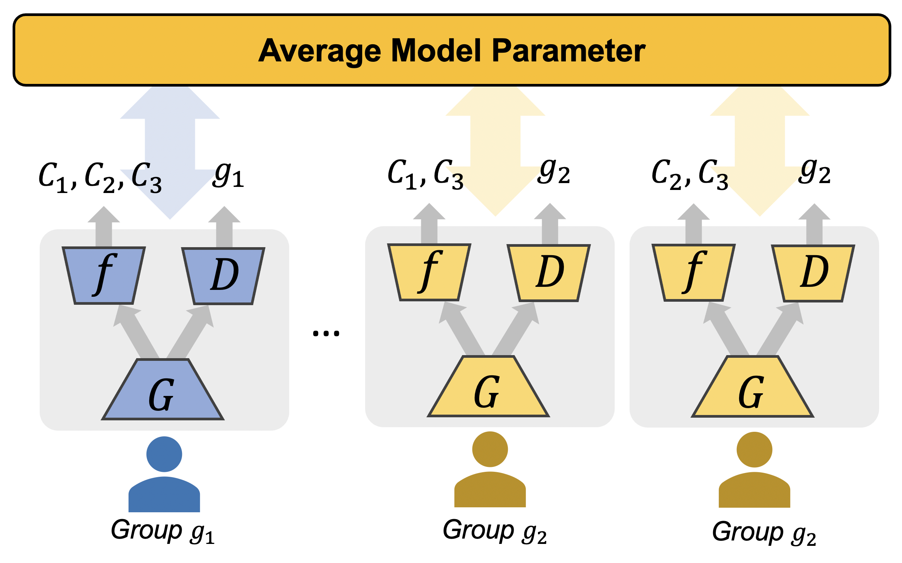

Federated Adversarial Debiasing (FADE)
======================================

Paper title: Federated Adversarial Debiasing for Fair and Transferable Representations, KDD'21

**Abstract**

Federated learning is a distributed learning framework that is communication efficient and provides protection over participating users' raw training data. One outstanding challenge of federate learning comes from the users' heterogeneity, and learning from such data may yield biased and unfair models for minority groups. While adversarial learning is commonly used in centralized learning for mitigating bias, there are significant barriers when extending it to the federated framework. In this work, we study these barriers and address them by proposing a novel approach Federated Adversarial DEbiasing (FADE). FADE does not require users' sensitive group information for debiasing and offers users the freedom to opt-out from the adversarial component when privacy or computational costs become a concern. We show that ideally, FADE can attain the same global optimality as the one by the centralized algorithm. We then analyze when its convergence may fail in practice and propose a simple yet effective method to address the problem. Finally, we demonstrate the effectiveness of the proposed framework through extensive empirical studies, including the problem settings of unsupervised domain adaptation and fair learning.



## Usage
### Setup Environment
Clone the repository and setup the environment.
```shell
git clone git@github.com:illidanlab/FADE.git
cd FADE
# create conda env
conda env create -f conda.yml
conda activate fade
# run
python -m fade.mainx
```

To run repeated experiments, we use `wandb` to log. Run
```shell
wandb sweep <sweep.yaml>
```
Note, you need a wandb account which will be required at first run.

### Download Datasets

* **Office**: Download zip file from [here](https://drive.google.com/file/d/0B4IapRTv9pJ1WGZVd1VDMmhwdlE/view) (preprocessed by [SHOT](https://github.com/tim-learn/SHOT)) and unpack into `./data/office31`. Verify the file structure to make sure the missing image path exist.
* **OfficeHome**: Download zip file from [here](https://drive.google.com/file/d/0B81rNlvomiwed0V1YUxQdC1uOTg/view) (preprocessed by [SHOT](https://github.com/tim-learn/SHOT)) and unpack into `./data/OfficeHome65`. Verify the file structure to make sure the missing image path exist.

### Download Pre-trained Source-domain Models

For each UDA tasks, we pre-train models on the source domain first. You can pre-train these models by yourself:
```shell
source sweeps/Office31_UDA/A_fedavg.sh
```
Instead, you may download the pre-trained source-domain models from [here](https://www.dropbox.com/sh/0imy8vft8o3mph8/AABhNuzbW02OmwboMu84e672a?dl=0). Place under `out/models/`.  

### Pre-trained adapted models

To add soon.

## Run UDA experiments

* Office dataset
    ```shell
    # pretrain the model on domain A, D, W.
    source sweeps/Office31_UDA/A_fedavg.sh
    # create wandb sweeps for A2X, D2X, W2X where X is one of the rest two domains.
    # the command will prompt the agent commands.
    source sweeps/Office31_UDA/sweep_all.sh
    # Run wandb agent commands from the prompt or the sweep page.
    wandb agent <agent id>
    ```
    Demo wandb project page: [fade-demo-Office31_X2X_UDA](https://wandb.ai/jyhong/fade-demo-Office31_X2X_UDA?workspace=user-jyhong). Check [sweeps](https://wandb.ai/jyhong/fade-demo-Office31_X2X_UDA/sweeps?workspace=user-jyhong) here.
* OfficeHome dataset
    ```shell
    # pretrain the model on domain R
    source sweeps/OfficeHome65_1to3_uda_iid/R_fedavg.sh
    # create wandb sweeps for R2X where X is one of the rest domains.
    # the command will prompt the agent commands.
    source sweeps/OfficeHome65_1to3_uda_iid/sweep_all.sh
    # Run wandb agent commands from the prompt or the sweep page.
    wandb agent <agent id>
    ```

## Extend with other debias methods

To extend FADE framework with other debias methods, you need to update the user and server codes. To start, please read the `GroupAdvUser` class in [fade/user/group_adv.py](fade/user/group_adv.py) and `FedAdv` in [fade/server/FedAdv.py](fade/server/FedAdv.py).

Typically, you will need to update the `compute_loss` function in `GroupAdvUser` class to customize your loss computation.

------------

If you find the repository useful, please cite our paper.
```bibtex
@inproceedings{hong2021federated,
  title={Federated Adversarial Debiasing for Fair and Transferable Representations},
  author={Hong, Junyuan and Zhu, Zhuangdi and Yu, Shuyang and Wang, Zhangyang and Dodge, Hiroko and Zhou, Jiayu},
  booktitle={Proceedings of the 27th ACM SIGKDD International Conference on Knowledge Discovery \& Data Mining},
  year={2021}
}
```

**Acknowledgement**

This material is based in part upon work supported by the National Science Foundation under Grant IIS-1749940, EPCN-2053272, Office of Naval Research N00014-20-1-2382, and National Institute on Aging (NIA) R01AG051628, R01AG056102, P30AG066518, P30AG024978, RF1AG072449.
